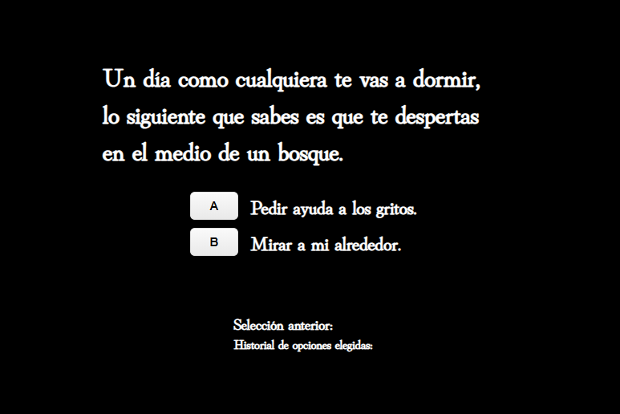

# Primer entregable Frontend III 

En este proyecto podrás elegir tu propia aventura!

## Descripción

- Este proyecto fue creado con [Create React App](https://github.com/facebook/create-react-app).
- Se manejarón componente de clase.
- Se utilizarón props, this.state y setState.
- Se utilizó componentDidMount como método del ciclo de vida, para montar el componente principal (Historia).

## Links

Codesandbox: https://codesandbox.io/s/delicate-shadow-d5gw3

